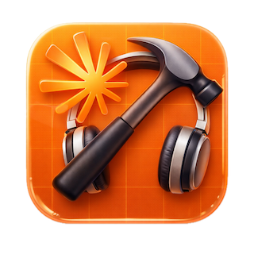

# VibeClauded 🎧

<a href="https://dfklabs.vercel.app" target="_blank"></a>
<a href="LICENSE" target="_blank"></a>
<a href="https://www.apple.com/macos" target="_blank"></a>


<p align="center"> 
  <a href="https://github.com/daifukus/vibeclauded/releases/tag/v1.0.0">
    
  </a>
</p>

```
  ╦  ╦╦╔╗ ╔═╗╔═╗╦  ╔═╗╦ ╦╔╦╗╔═╗╔╦╗
  ╚╗╔╝║╠╩╗║╣ ║  ║  ╠═╣║ ║ ║║║╣  ║║
   ╚╝ ╩╚═╝╚═╝╚═╝╩═╝╩ ╩╚═╝═╩╝╚═╝═╩╝
   Monitor for Claude in Xcode - Get notified when Claude finishes generating.
```

## Features

- 🔔 Sound notification when Claude finishes
- 🪟 Brings Xcode to foreground automatically
- ⌘R **Auto-Run** - Automatically triggers build & run when Claude finishes
- 📊 Real-time status display with animated spinner
- 🚀 Auto-opens Xcode if not running
- ⏱️ 5-minute idle timeout notification
- ⏸️ Pause/resume monitoring
- 🎨 Native macOS UI with Liquid Glass design (App version)
## Installation

### Option 1: Native App (Recommended)

Beautiful native macOS app with Liquid Glass UI.

1. Download `VibeClaude.zip` from [Releases](../../releases/latest)
2. Unzip and drag `VibeClaude.app` to `/Applications`
3. First launch: **Right-click → Open**
4. Grant Accessibility permissions when prompted

<p align="center">
  
</p>

### Option 2: Terminal Script

Lightweight bash script for terminal lovers.

```bash
curl -O https://raw.githubusercontent.com/daifukus/vibeclaude/main/xcode.sh
chmod +x xcode.sh
./xcode.sh
```

<p align="center">
  
</p>

## Comparison

| Feature | Native App 🖥️ | Terminal Script 💻 |
|---------|:-------------:|:------------------:|
| **Interface** | Liquid Glass UI | Terminal-based |
| **Installation** | Drag & drop | Single command |
| **macOS Version** | 14.0+ | 10.15+ |
| **Start Monitoring** | Start button | Press `1` |
| **Pause Monitoring** | Pause button | Press `2` |
| **Exit** | Exit button | Press `3` |
| **Toggle Auto-Run** | Switch toggle | Press `0` |
| **Visual Feedback** | Animated spinner | Text status |
| **Resource Usage** | Low | Minimal |
| **Best For** | Daily use | Quick setup / Servers |

## Usage

### Auto-Run Mode

When Auto-Run is **ON** (enabled by default), VibeClaude will automatically:

1. Play notification sound
2. Bring Xcode to foreground
3. Trigger ⌘R to build and run your project

Toggle with `0` (script) or the switch (app) to change modes.

## Requirements

- macOS 14.0+ (App) / macOS 10.15+ (Script)
- Xcode with Claude integration
- Accessibility permissions

> **Note:** First run will ask for Accessibility permissions in *System Settings → Privacy & Security → Accessibility*

## License

MIT License - see [LICENSE](LICENSE) for details.

---

Made with ❤️ by <a href="https://dfklabs.vercel.app" target="_blank">DFKlabs</a>
